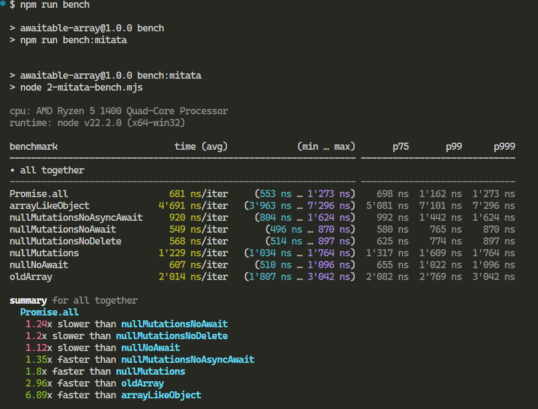

# awaitable-array
Make await array behavior similar to built-in `Promise.all`

# Example

```js
const [a, b] = await [Promise.resolve(1), Promise.resolve(2)]
console.log(a, b) // should print 1, 2
```

# Add new user-defined approaches

To add new approach to be tested and benchmarked, it should fulfil following requirements:  
- Should be a `thenable` function
- Ecmascript module syntax
- named function (will be used in tests and benchmarks as label)
- default exported
- be in separate file inside [approahces](./approaches/) directory

If necessary function could also by async.
Approach will automaticaly be assigned to `Array.prototype.then` during tests.

Here is an example of correctly disgned approach:
```js
export default function testApproach (resolve) {
  // some code here
  
  resolve(this)
}
```

# Running tests

Before running tests make sure all necessary dependencies to be installed via
```
npm i
```

## Test for correctness
```
npm run test
```
or
```
npm t
```

## Benchmark comparison against other approaches
```
npm run bench
```


